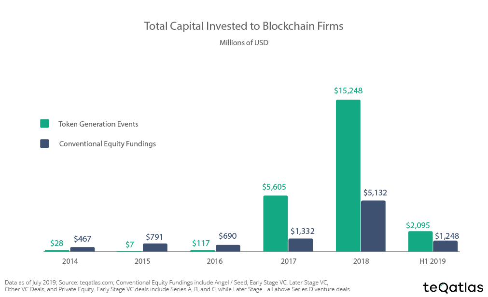
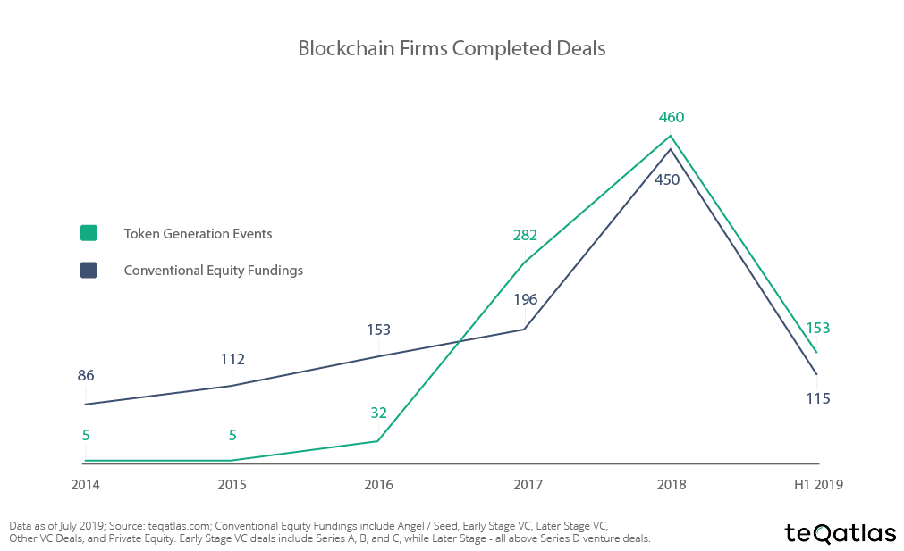

## TL;DR
**In the last years, token-financed projects became popular due to the lack of regulations and crowd appetite to become early participants. Token-based investments are usually based on an open source project that aims for early user participation and lures investors with a token of their own. The value is to be shared among users and not among large shareholders and venture capitalists (VC), as has been the case in the past. But, unfortunately, this format comes with a trade-off that has not been stressed enough in the past. So read on.**
— Authors: Raphael Hagemann, Enrique Munoz de Cote

Of course, the traditional way is inconvenient and consumes a lot of time and resources. From pre-seed to seed phase, Series A to X to exit (like an IPO) is a hell of a long way to go. You constantly have to contact and acquire new investors, visit startup events and investor fairs, and it might seem to you as CEOs that you’re chasing money rather than building your business.

So why not launch your own token, raise enough money for a while, be independent of regulators, and not have a VC breathing down your neck? The benefits from an entrepreneur’s perspective seem limitless. You immediately build a community that is also willing to expand your brand because they have a financial incentive to do so through the token. They bring network effects and you are not even legally obligated to them. Let me explain why this could be construed as extremely short-sighted.

**Investor commitment.** The token holders might not be as committed as you would like. The token is usually very liquid and *nothing binds the token holder* to not dump your token in favour of the next hyped project. Instead of investors willing to go the extra mile with you, your token holders might just be speculators looking for short-term profit.

**Smart money.** If you decide to play the traditional equity game which includes VCs and business angels, you’ll soon recognise the incredible value they bring to your startup. VCs know the market, have a wide network, which brings new potential collaborations and recruitment opportunities, and are usually used to a high-risk environment. Due to their involvement in that market, they have the ability to develop ideas and proposals that could *really help you take the next step*. We call this smart money.

**Due Diligence.** As a CEO you early have to decide if you go the community or the VC route but the latter could help you to really *grow your business in the right direction*. VCs know each other, so the fact that a VC has already invested in you kind of puts a seal of quality on you for potential other VC’s. That’s what we call shared due diligence. And it’s really effective. Vice versa, financing your business token-backed only could be a hint for other potential VCs that *your startup could not qualify for venture capital* in the first place. Also if you start by financing your business with venture capital you can always still bring your token to finance certain projects. The other way around might be harder. VCs might not fall for buzzword marketing (i.e. blockchain, crypto, decentralisation) as easily as the masses.

**Alternatives Equity Options.** You probably think that token economics allows retail investors to participate in potential new market leaders at a very early stage. And that’s a good thing, right? However, this is also the biggest downside, for *9 out of 10 startups fail*. Being devil’s advocate here, despite the enormous upside potential for token holders, greater democratisation could also be achieved through VC syndicates allowing small investors for early-stage investments. And as for the lack of commitment of your token holders, you could address this problem by a construct called crowd equity funding, where the investment stake is not liquid until a so-called exit event. A point in time when the company either goes public via an IPO (Initial public offering) or when larger investors show up and pay out the older ones. This is a potential way to increase trust and commitment. Of course, there are parallels to token funding but, for instance, crowdfunding in series B could be interpreted as higher standards than a whiteboard pitch funding which flushes millions into the coffers *without itself having a more precise plan of how to confront its idea with reality*.

**Liquidity.** While in venture capital funding there is only a company valuation every few years, the constant pricing of tokens by the market is a mechanism that can quickly drive a young company to ruin. VCs know about this vulnerability and protect accordingly through incubator structures. *You can’t afford too much valuation and publicity in the early stage.*

**Transparency and communication.** Even if you can track trading of your token on the blockchain, you still don’t know your investors. Hence, there is no efficient communication channel in which you can share ideas or validate contributions from your stakeholders. Until you have the ability to respond to your investors’ requests, you make yourself *dependent on the goodwill of token holders*. If your tokens are dumped, it could hurt your business so much that you can never get funding again. Not through the market, and certainly not through VCs. Of course, you have to differentiate between financing your startup via tokens or issuing a token for marketing purposes. It might be worthwhile to pay the community additional perks for their services via their own token (e.g. for DAO engagement). But only if you are well financed with real equity.

For the investor on the other side, you lack transparency and control mechanisms over the startup’s management. Dilution is a big problem. The startup could just issue a new token where, unlike VCs, there are no legal rights for the investor, such as a right of first refusal for new shares. It could be enshrined in the smart contract that the minting of new tokens is not possible, but as an issuer, this could easily be circumvented by selling tokens from one’s own holdings, which would have the consequence that the profit would henceforth be divided among several investors, *which per se represents profit dilution*.

**Underlying risk.** Issued tokens are stored on a blockchain (e.g. Ethereum or Solana) and only exist there. However, *no one guarantees you that the blockchain will even exist in a few years*. A risk that is underestimated by most. Hacks to the smart contract or the token economics is another very plausible risk worth mentioning, and last but not least, one’s own token also correlates strongly with the fluctuation of the cryptocurrency of the underlying blockchain, which has repeatedly proven to be extremely high in recent years.

**Most efficient capital allocation.** In our opinion, here comes the strongest argument for VC funding. After a successful (pre) seed round, the next step would be to prove yourself worthy, use the money to grow a team, create a product (or service), enter new markets and de-risk the case for your investor. This is no small feat, but if you succeed, it is more likely that VCs will invest more capital. The market should penalise startups that squander money by not giving them more of it. If your startup raises tons of money in an ICO (Initial coin offering) and you also happen to be on a bull market you suddenly sit on a huge pile of money with the risk of also burning a lot of it. Here, there are *no clear incentives that lead to a more efficient allocation of capital*.

**Missing awareness for investors.** The main criticism we see in the token economy is that most retail investors are probably *unaware of how risky their investments* really are. Unlike VCs, who are used to assessing risk, understand the uncertainties associated with their investment decisions and implement complex (hedging) strategies against such risks, retail investors are mostly oblivious to such strategies. In the past, crowd sentiment and unfounded hopes for the upside were deliberately stirred up and then exploited. Startups should therefore ask themselves whether it is morally justifiable to sell a commodity that statistically is very plausible to be worth nothing in the mid-term.

## Closing remarks
Although tokens are democratising the investment market and bring the potential to really high returns, it is important to create more awareness through better educational content to protect individual investors and ensure that reputable projects like utility tokens for marketing purposes do not completely lose their trustworthiness in the crypto space.

We are now seeing novel funding mechanisms and platforms popping into the space that aim to reduce the risk of investing in new blockchain projects. A good example is CloudFunding, a launchpad created by Lena Instruments and FlareNetwork that intend to protect investors’ staked capital by keeping it in the hands of the investors themselves. Parachain auctions (the core implementation of the network Polkadot) are another good example of such an effort. Compared to ICOs, IDOs and IEOs, where you invest your tokens and lose them, in parachain auctions your (DOT) tokens are locked for some fixed time (usually two years) and then returned to the investor.

In our view the balance is still tilted in favour of VC funding because of the reasons mentioned above, but we hope the balance gets levelled in the near future. Goes without saying that there is no one size fits all winning recipe when it comes to financing your blockchain startup. The most important elements to consider are the stage of the venture and the kind of support needed. Ultimately, one way or the other, we want smart money coming in and not selling your company’s soul to the devil just for some quick solution. We look forward to unpacking in a follow-up article what these new funding platforms bring to entrepreneurs in the space.

## Sources:
https://www.forbes.com/sites/neilpatel/2015/01/16/90-of-startups-will-fail-heres-what-you-need-to-know-about-the-10/?sh=3c9f25516679

*If you like this article, feel free to forward it to your colleagues or share it on social media. If you are an expert in the field and want to criticise or endorse the article or some of its parts, please leave a private note here or contact one of the authors.*

## Authors
**Raphael Hagemann** is project manager at Germany’s biggest market maker and AI student at the International University. His fields of interests — besides Artificial Intelligence — are Web3, Blockchain, the Dataverse, Bitcoin, as well as all forms of decentralization. These are also the subjects he addresses on social media. He was a participant of “Influencer by DNA”, a 6-week mentoring program to become an Influencer and Thought Leader in the blockchain space. He also volunteers as a Brand Ambassador for Ocean Protocol, a blockchain-based marketplace that tokenizes datasets and data services for efficient data use and data monetization.
You can contact him via [LinkedIn](https://www.linkedin.com/in/raphael-hagemann/) or follow him on [Twitter](https://twitter.com/RaphaelHagemann).

**Enrique Munoz de Cote** is a serial entrepreneur, currently tech co-founder of Dark Matter Ventures (a catalyser of AI and blockchain technologies), a computer science associate professor at INAOE and a member of the board of directors of the Association for Trading Agent Research (ATAR). He’s a recognised Machine Learning scholar who authored two books and over 70 papers in the intersection between machine learning, information theory and economics. In the past, his research as Director of multi-agent science at Secondmind led to new AI developments for industries (including three patent applications) on supply-chains. He has advised and consulted for several VC-backed machine learning startups and scale-ups in industries such as real estate, biotech and insurtech, and has helped the UK government (the Cabinet Office in particular) program machines that can understand their natural language documents.
You can contact him via [LinkedIn](https://www.linkedin.com/in/enriquedecote/) or follow him on [Twitter](https://twitter.com/enriquedecote).